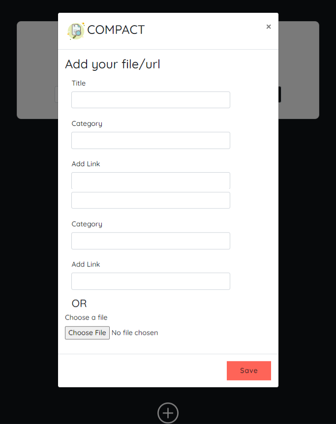
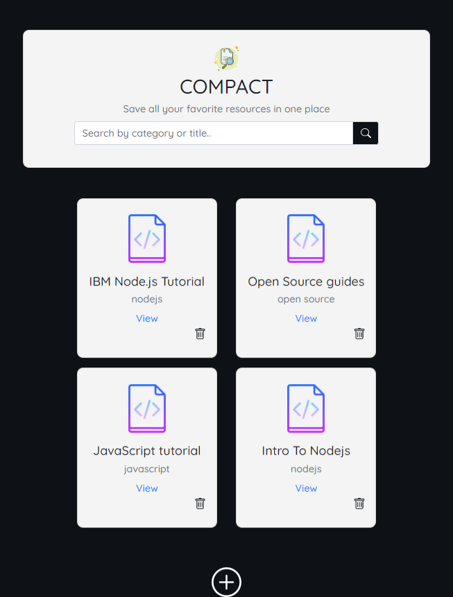

## Compact App

### Description
An app that enables users save url as compact files and share fils via social media.

---

### Technologies and Tools
* JavaScript ES6
* HTML
* CSS
* Bootstrap
* Firebase

---

### Live Site

https://compactapp.netlify.app/

---

### Data Flow
* A user can click on the add button which opens up a modal where the user can input the title, category and paste the url link which is then saved as a file which can be accessed when offline.

*  A user can search for a specific file based on title or category and sort files base on recently added or alphabetically.

* A user can share these files via social media.

### In Development

* Sharing Files to social media
* Sorting Files based on parameters.

### Learning Process

Building this project helped solidify my knowledge of javascript es6 concepts, array methods, event delegation (used while building the delete button o each file), DOM manipulation and persisting files to local storage and accessing offline using firebase database.

